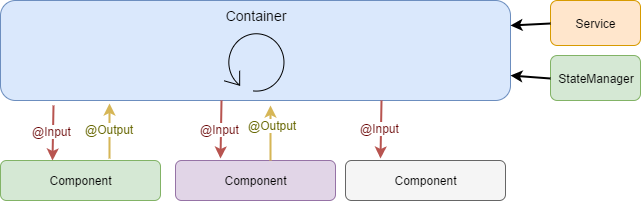
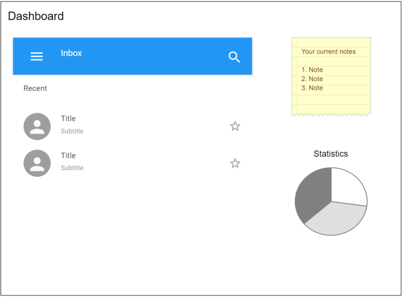

# Scalable Angular Application Architecture
[source](https://bulldogjob.com/articles/539-scalable-angular-application-architecture)
####  Architecture principles
1. Project structure
    >how to organize you project files, define and work with Angular modules and their dependencies
2. Data flow architecture
    >how the data flows through your application layers
3. State management
    >how to manage the state of GUI and propagate it between different application parts
### What is a scalable architecture ?
#### Scalability factors:
- increasing size of data loaded to the application
- growing complexity and size of the project
>usually followed by longer loading times.
###Structure of the application
- One of the first things you do when you set up a new project is to define the structure of the application, one of them is the module-oriented project structure.
- A very important element of this approach is isolation of modules.
>you can delete one of modules from the application, and the rest will work without any problems.
- some services and components have to be reused across the whole application
> some parts of application functionality are stored in "Core" and "Shared" modules
- Now our application structure looks like this:<br>
<br><br>

1. AppModule
    >responsible for launching the application and combining other modules together
2. CoreModule
    >mostly global services, that will be used in the whole application globally
    **```should not```** be imported by other application modules
3. SharedModule
    > will be reused in other application modules, not applied globally. They can be imported by feature modules.

All remaining modules (so-called feature modules) should be isolated and independent.
###Lazy Loading
It allows to defer the loading of a particular part of the application until it's actually needed 
>(usually when the user wants to access a particular screen of the application)

<br><br>
```{path: ‘user’, loadChildren: ‘./users/user.module#UserModule’}```

###Data flow
In our application we've introduced the idea of "smart" and "dummy" components.
>The smart components are also called "Containers".

Clearly define the parts of the application that contain some logic, communicate with services and cause side effects (like service calls, state updates etc.). Every such action is implemented only in Containers. 
On the contrary, "stupid" components have very little or no logic at all. All the data they need is passed by ```@Input``` (emit via ```@Output``` attribute) parameters.
<br><br>
Keep the number of Containers as small as possible. The more components in the application are "dummy", the simpler is the data flow and the easier it is to work with it.
##### Deciding which component should take the role of a Container
Usually the first step we take is assuming that a main screen component should be the smart one, as in the example below, when the container is marked with blue color and simple components are gray.

<br><br>
>After that, it's a matter of finding a good balance between a small number of containers and keeping the single responsibility principle.

A dashboard screen is a perfect example of multiple smart containers displayed on a single screen. Every dashboard tile would be smart and responsible for its own behavior, data and logic.
<br><br>
### State management
Everything that the  user sees on the screen is a reflection of the state of the application. When they perform a certain action, some data is loaded, or any other event occurs - application logic is executed and the GUI state is modified. 
##### Single store to rule them all
>The Angular community has widely adopted the Redux architecture pattern

The idea behind Redux is that the whole application state is stored in one single Store, the object that represents the current state of the application. A Store is immutable, it cannot be modified, every time a state needs to be changed, a new object has to be created.
<br><br>
####Actions and Reducers
A Store cannot be accessed and modified directly, use **reducers** for this.
>simple function that takes an action as an argument

<br><br>
#####State propagation
One of the most popular  implementation of Redux pattern in Angular is definitely ngrx/store.
>**Once the modification to the store is applied, all subscribers are notified about the change.**

<br><br>
#####State services
Good practice to encapsulate Store operations in dedicated services. Such services can then be reused across the module or application, and our components do not have be aware of the details of state operations.
<br><br>
###Combining state management and data flow
**The patterns described are really powerful.**
Redux-base state management provides bullet proof synchronization between various parts of the application
and the idea of an immutable state.
Unidirectional data flow and the idea of smart containers provides well-defined points of responsibility in the application and the pattern of how to propagate upcoming state modifications to the dummy components below.
<br><br>
